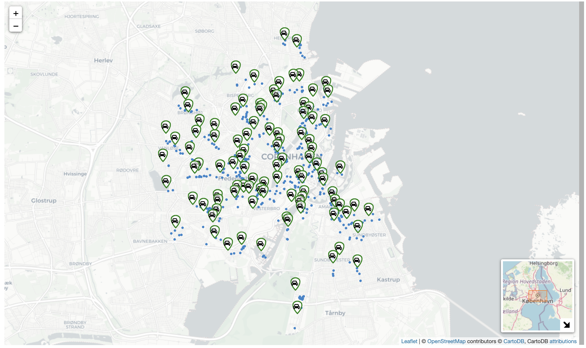
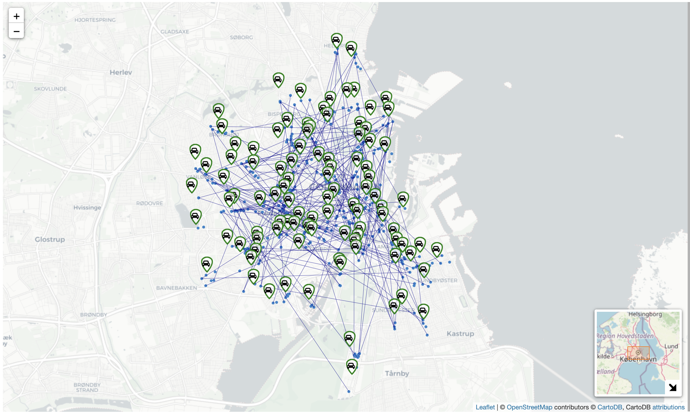

# Instances_EnvConsciousPricing
This repository contains codes and data scratched from Google Map APIs for generating instances in the article 
"Environmentally-conscious carsharing pricing using bi-objective optimization" by J. Deng, K. Fagerholt, and G. Pantuso. 
The instance generator is written in Python. This repository contains 4 folders as described below.

# Input_data
* [geo_info_css.csv](/Input_data/geo_info_css.csv): Each row describes the geographical data (latitude, longitude) of each carsharing station.
* [distances_between_stations.csv](/Input_data/distances_between_stations.csv): Each row records the distances and durations for each pair of stations obtained by Google Map APIs.
* [geo_info_POIs.csv](/Input_data/geo_info_POIs.csv): The collected points of interest are used to generate potential carsharing customers. For each POI, we store the nearest CS station, and the latitude and longitude of it.
* [geo_info_travellers.csv](/Input_data/geo_info_travellers.csv): Each traveller is generated by taking two random POIs as the origin and destination.
* [trip_info_multi_modes.csv](/Input_data/trip_info_multi_modes.csv): Each row describes the travel data (e.g., travel times) relating to multiple transport mode for each traveller.

# Instance_generation
In this folder, [request_gen.py](/Instance_generation/request_gen.py) is used to generating the whole set of potential customers of carsharing 
(i.e., the set of travellers who would prefer carsharing to any other mode under at least one pricing level). Here, 
by taking the values of parameters representing either traveller's preferences or transport costs as stated in [arg.py](Instance_generation/args.py), 
the generated requests are collected in [request_dataset.csv](/Input_data/request_dataset.csv).

The [instance_gen.py](/Instance_generation/instance_gen.py) is used to generate instances of different sizes. It takes the [request_dataset.csv](Input_data/request_dataset.csv) as an input. 
One can further control the following parameters for generating instances as required. 
* --name_of_instance 'k'+(the number of customers) + 'v' + (the number of vehicles).
* --veh_loc takes value 0 if initial locations of vehicles are generated based on customer density, 1 if vehicles take random initial locations.

For example, by setting --name_of_instance to 'k200-v150' and 'veh_loc' to '0', at random seed 0 we could generate instance [i100r200v150seed0veh_gen0.csv](Instances/i100r200v150seed0veh_gen0.csv) as shown in [Instances](/Instances) folder.

# Instances
The folder stores the relevant data associated with each instance.

# Map_visualization
The folder contains three files for visualizing the maps of the studied carsharing system, which are
* [heatmap_cus_density.html](/Map_visualization/heatmap_cus_density.html): It shows the overall distribution of CS stations and the customer densities among stations.
* [Map_data_visualization.ipynb](/Map_visualization/Map_data_visualization.ipynb): We show the locations of obtained POIs in the map
  
Taking a case with 200 customers as an example, we show the origin and destination of each customer.
  
* [route_map.html](/Map_visualization/route_map.html): We show the real-world transport routes associated with a specific customer (represented by its origin and destination points in the map). Different colors distinguish the type of transport modes the traveller can take.
